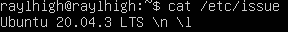
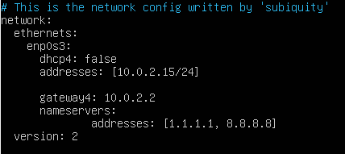

# ОТЧЁТ Операционные системы UNIX/Linux

## Contents
1. [Установка ОС](#part-1-установка-ос)  
2. [Создание пользователя](#part-2-создание-пользователя)  
3. [Настройка сети ОС](#part-3-настройка-сети-ос)   
4. [Обновление ОС](#part-4-обновление-ос)  
5. [Использование команды  sudo](#part-5-использование-команды-sudo)  
6. [Установка и настройка службы времени](#part-6-установка-и-настройка-службы-времени)  
7. [Установка и использование текстовых редакторов](#part-7-установка-и-использование-текстовых-редакторов)  
8. [Установка и базовая настройка сервиса SSHD](#part-8-установка-и-базовая-настройка-сервиса-sshd)   
9. [Установка и использование утилит top, htop](#part-9-установка-и-использование-утилит-top-htop)   
10. [Использование утилиты fdisk](#part-10-использование-утилиты-fdisk)   
11. [Использование утилиты df](#part-11-использование-утилиты-df)    
12. [Использование утилиты du](#part-12-использование-утилиты-du)    
13. [Установка и использование утилиты ncdu](#part-13-установка-и-использование-утилиты-ncdu)    
14. [Работа с системными журналами](#part-14-работа-с-системными-журналами)     
15. [Использование планировщика заданий CRON](#part-15-использование-планировщика-заданий-cron)    

## Part 1. Установка ОС

- Узнайте версию Ubuntu, выполнив команду \
`cat /etc/issue.`

## Part 2. Создание пользователя

- Вставьте скриншот вызова команды для создания пользователя.

- Новый пользователь должен быть в выводе команды \
`cat /etc/passwd`
- Вставьте скриншот с выводом команды.

## Part 3. Настройка сети ОС

##### Задать название машины вида user-1  

- sudo nano /etc/hostname
- reboot

##### Установить временную зону, соответствующую вашему текущему местоположению.  

##### Вывести названия сетевых интерфейсов с помощью консольной команды.

- lo или local loopback (локальная петля). Служит для подключения по сети к этому же компьютеру и не требует дополнительной настройки;

##### Используя консольную команду получить ip адрес устройства, на котором вы работаете, от DHCP сервера. 

- DHCP (Dynamic Host Configuration Protocol) - это протокол, который автоматически назначает сетевые настройки, такие как IP-адрес, маска подсети, шлюз по умолчанию и DNS-серверы, устройствам в сети.

##### Определить и вывести на экран внешний ip-адрес шлюза (ip) и внутренний IP-адрес шлюза, он же ip-адрес по умолчанию (gw). 

- внешний ip-адрес шлюза (ip)

- внутренний IP-адрес шлюза

##### Задать статичные (заданные вручную, а не полученные от DHCP сервера) настройки ip, gw, dns (использовать публичный DNS серверы, например 1.1.1.1 или 8.8.8.8).  

- sudo nano /etc/netplan/00-installer-config.yaml

было

стало

- reboot

## Part 4. Обновление ОС

##### Обновить системные пакеты до последней на момент выполнения задания версии.  

## Part 5. Использование команды **sudo**

##### Разрешить пользователю, созданному в [Part 2](#part-2-создание-пользователя), выполнять команду sudo.

- Sudo — это утилита, предоставляющая привилегии root для выполнения административных операций в соответствии со своими настройками. Она позволяет легко контролировать доступ к важным приложениям в системе. По умолчанию, при установке Ubuntu первому пользователю (тому, который создаётся во время установки) предоставляются полные права на использование sudo. Т.е. фактически первый пользователь обладает той же свободой действий, что и root.

## Part 6. Установка и настройка службы времени

##### Настроить службу автоматической синхронизации времени.  

- Вывод следующей команды должен содержать `NTPSynchronized=yes`: \
  `timedatectl show`

## Part 7. Установка и использование текстовых редакторов 

##### Установить текстовые редакторы **VIM** (+ любые два по желанию **NANO**, **MCEDIT**, **JOE** и т.д.)  

- sudo apt install vim
- sudo apt install nano
- sudo apt install mcedit

##### Используя каждый из трех выбранных редакторов, создайте файл *test_X.txt*, где X -- название редактора, в котором создан файл. Напишите в нём свой никнейм, закройте файл с сохранением изменений.  

- vim test_VIM.txt
- Режим редактора - i
- Выйти из режима - esc
- Выйти с сохранением - :wq

- mcedit test_MCEDIT.txt
- Выход с охранением: F2 (yes) + F10

- nano test_NANO.txt
- Выход с охранением: CTRL + x, затем y и enter

##### Используя каждый из трех выбранных редакторов, откройте файл на редактирование, отредактируйте файл, заменив никнейм на строку "21 School 21", закройте файл без сохранения изменений.

- Выйти без сохранения - :q!

- Выход без сохранения: F10(no)

- Выход без сохранения: CTRL + x, затем n

##### Используя каждый из трех выбранных редакторов, отредактируйте файл ещё раз (по аналогии с предыдущим пунктом), а затем освойте функции поиска по содержимому файла (слово) и замены слова на любое другое.

- Поиск: /искомое

- Замена: :s/что хотим изменить/на что хотим заменить

- Итог в vim

- Поиск: F7 + <текст который ищем> + <ок>

- Замена: F4 + <что хотим изменить> + <на что хотим заменить> + replace

- Итог в mcedit

- Поиск: CTRL + W, затем enter (alt + w для перехода к след. вхождению, ctrl + c для преращения поиска)

- Замена: CTRL + \ что хотим изменить + enter/на что хотим заменить + enter

- Итог в nano

## Part 8. Установка и базовая настройка сервиса **SSHD**

##### Установить службу SSHd.  

- sudo apt-get install ssh
- sudo apt install openssh-server

##### Добавить автостарт службы при загрузке системы.  

- sudo systemctl enable ssh
- systemctl status ssh

##### Перенастроить службу SSHd на порт 2022.  

- sudo nano /etc/ssh/sshd_config

- раскоментировать строку
- systemctl restart sshd

##### Используя команду ps, показать наличие процесса sshd. Для этого к команде нужно подобрать ключи.

- ps (показывает запущенные процессы, выполняемые пользователем в окне терминала);
- ps -e или ps -A (Чтобы просмотреть все запущенные процессы);
- ps -d (Чтобы показать все процессы, кроме лидеров сессии);
- ps -d -N (можно инвертировать вывод с помощью переключателя -N. Например, если хочу вывести только лидеров сеансов)
- ps T (увидеть только процессы, связанные с этим терминалом);
- ps r (просмотреть все работающие (running) процессы);
- ps -p 'pid' (если вы знаете идентификатор процесса PID, вы можете просто использовать следующую команду, для вывода процесса с этим 'pid');
- ps -p 'pid1' 'pid2'
- ps U 'userlist' (найти все процессы, выполняемые конкретным пользователем);
- ps -ef (получить полный список);

##### Перезагрузить систему.
- reboot

- Вывод команды netstat -tan должен содержать  \ `tcp 0 0 0.0.0.0:2022 0.0.0.0:* LISTEN` \

- -t (--tcp) отображает соедниеня только по tcp
- -a (--all) вывод всех активных подключений TCP
- -n (--numeric) вывод активных подключений TCP с отображением адресов и номеров портов в числовом формате
- Proto: Название протокола (протокол TCP или протокол UDP);
- recv-Q: очередь получения сети
- -Q: Сетевая очередь отправки
- Local Address адрес локального компьтера и используемы номер порта
- Foreign Address адрес и номер удаленного компьтера к которомц подключен сокет
- State состояние сокетв
- 0.0.0.0 означает IP-адрес на локальной машине

## Part 9. Установка и использование утилит **top**, **htop**

##### Установить и запустить утилиты top и htop.  

- По выводу команды top определить и написать в отчёте:
  - uptime - 5 min
  - количество авторизованных пользователей - 1
  - общую загрузку системы - 0,05, 0,05, 0,01
  - общее количество процессов - 95
  - загрузку cpu - 0,3%
  - загрузку памяти - 150,9/344,0
  - top -o %MEM. pid процесса занимающего больше всего памяти - 664
  - top -o %CPU. pid процесса, занимающего больше всего процессорного времени - 670

- В отчёт вставить скрин с выводом команды htop:
  - отсортированному по PID, PERCENT_CPU, PERCENT_MEM, TIME (F6)

  
  
  
  
  - отфильтрованному для процесса sshd (F4)

  
  - с процессом syslog, найденным, используя поиск (F3)

  
  
  - с добавленным выводом hostname, clock и uptime

  

## Part 10. Использование утилиты **fdisk**

##### Запустить команду fdisk -l.

- название жесткого диска - VBOX HARDDISK;
- размер - 25GiB;
- количество секторов - 52428800;
- размер swap - 3,9GiB.

## Part 11. Использование утилиты **df** 

##### Запустить команду df.  

- В отчёте написать для корневого раздела (/):
  - размер раздела - 20466256
  - размер занятого пространства - 6860220
  - размер свободного пространства - 12541076
  - процент использования - 36%
- Определить и написать в отчёт единицу измерения - килобайт

##### Запустить команду df -Th.

- В отчёте написать для корневого раздела (/):
    - размер раздела - 20G
    - размер занятого пространства - 6,6G
    - размер свободного пространства - 12G
    - процент использования - 36%
- Определить и написать в отчёт тип файловой системы для раздела - ext4

## Part 12. Использование утилиты **du**

##### Запустить команду du.
##### Вывести размер папок /home, /var, /var/log (в байтах, в человекочитаемом виде)

в байтах 

в человекочитаемом виде 

##### Вывести размер всего содержимого в /var/log (не общее, а каждого вложенного элемента, используя *)

## Part 13. Установка и использование утилиты **ncdu**

##### Установить утилиту ncdu.
- sudo apt-get install ncdu
##### Вывести размер папок /home, /var, /var/log.

- Размеры должны примерно совпадать с полученными в [Part 12](#part-12-использование-утилиты-du).

-ncdu /home, ncdu /var, ncdu /var/log

## Part 14. Работа с системными журналами

##### Открыть для просмотра:
##### 1. /var/log/dmesg
- sudo nano /var/log/dmesg
##### 2. /var/log/syslog
- sudo nano /var/log/syslog
##### 3. /var/log/auth.log
- sudo nano /var/log/auth.log

##### 4. Написать в отчёте время последней успешной авторизации, имя пользователя и метод входа в систему.
- 10:50:54; raylhigh by LOGIN

##### 5. Перезапустить службу SSHd.
- sudo systemctl restart ssh

##### 6. Вставить в отчёт скрин с сообщением о рестарте службы (искать в логах).

- sudo vim /var/log/syslog

## Part 15. Использование планировщика заданий **CRON**

- sudo crontab -e

##### Используя планировщик заданий, запустите команду uptime через каждые 2 минуты.

- Найти в системных журналах строчки (минимум две в заданном временном диапазоне) о выполнении.

- Вывести на экран список текущих заданий для CRON.

- Вставить в отчёт скрины со строчками о выполнении и списком текущих задач.

##### Удалите все задания из планировщика заданий.
- В отчёт вставьте скрин со списком текущих заданий для CRON.

